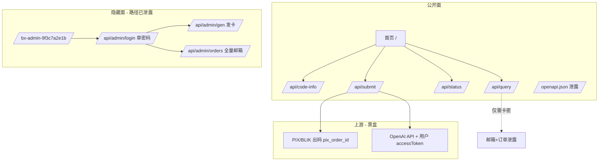

# baxigpt 系统研判与攻击思路总图

> 面向 CTF / 授权渗透：在**无赛题附件、无额外卡密**条件下的完整思路整理。

---

## 一、这系统到底是什么？开源吗？

### 结论：**不是开源项目，是闭源自研单体**

| 维度 | 判断 | 依据 |
|------|------|------|
| GitHub 服务端源码 | **不存在** | 搜 `baxigpt`、`baxi_codes.txt`、`api/admin/gen`、`pix_order_id` 均为 0 |
| 源码泄露 | **无** | `.git`、`.env`、`main.py` 等 404/403 |
| 开源客户端 | **有** | `reg-factory` 历史 `plus_baxi.py`、`AUTO-REGGPT/web/manager.py` 仅**调用公开 API** |
| 发卡系统模板 | **不像 acg-faka** | 路由/字段/前端风格均为自定义 FastAPI v0.1.0 |
| 作者水平 | **小团队速写** | 无 Pydantic schema、OpenAPI 裸奔、500 遍地、隐藏路径被写进 openapi |

**含义**：不能指望「下载源码找默认密码」；但**自研 + 赶工**意味着逻辑漏洞、类型漏洞、配置失误概率高——只是**不一定在后台密码上**。

### 架构一图



---

## 二、已测攻击面总表（截至第五轮）

| 类别 | 手法 | 结果 | 价值 |
|------|------|------|------|
| 弱口令 | 562+ 语境词 + Top67 + 56 hash/变形 + 40 创意空字符 | **0 命中** | 密码不是常见弱口令 |
| IP 伪造进后台 | XFF 127.0.0.1 等 | **401** | 无效 |
| IP 伪造绕过限流 | 随机 XFF | **成功** | ⭐ 可无限枚举 |
| Session 伪造 | itsdangerous 20 secret | **401** | 无效 |
| SQLi/NoSQLi 登录 | OR 1=1、$gt | **401** | 无效 |
| BFLA | 无 Cookie 调 admin | **401** | 鉴权一致 |
| IDOR status | 伪造 order_id/JWT | **查询失败** | 需真实 order_id |
| NoSQL query | `$gt` | **500** | DoS/潜在 |
| 类型混淆 submit.at | object/list/int | **500** | DoS/潜在 |
| form 登录 | urlencoded/multipart | **500** | 未绕过 |
| JSON 重复键 code | 后者覆盖前者 | **确认** | 见下文 |
| JSON 数组 login body | `[{pw},{pw}]` | **500** | DoS |
| 登录计时侧信道 | 空/长/短密码 | **无差异** ~0.7–0.9s | 难利用 |
| OpenAPI 内嵌密码 | 全文搜索 | **无** | - |
| GitHub 泄露密码 | reg-factory/AUTO-REGGPT | **仅 BAXI_CARDS 卡密池** | 非 admin |

---

## 三、已确认可利用漏洞（比赛优先写这些）

### 1. 限流绕过（高危）⭐

`X-Forwarded-For` / `X-Real-IP` 随机化 → 绕过 `429 错误次数过多`。

**攻击链**：无限 `code-info` / `query` 枚举卡密 → 拿到他人卡 → `query` 拉邮箱。

脚本：`exploits/ip_bypass_enum.py`

### 2. `/api/query` 隐私泄露（高危）

凭卡密返回全部 `orders[].email`，无需 token。

### 3. OpenAPI 全暴露（高危）

`/openapi.json` + `/docs` 公开 admin 全路由。

### 4. 未校验输入 → HTTP 500（中危）

典型「个人项目」特征，攻击面：

- `submit.at` 非字符串
- `code` 为 object（NoSQL 形）
- `admin/login` 非 JSON / 数组 body
- `application/x-www-form-urlencoded` 登录

**若比赛环境 `debug=True`**：同一 payload 可能返回 Python traceback（含路径、变量名，偶发含 secret）。

### 5. JSON 重复键参数污染（中危 · 新发现）

FastAPI/Python `json` **后者覆盖前者**：

```http
POST /api/code-info
{"code":"EU-AAAAAAAA","code":"EU-HFNDFHD4"}
→ 查的是 HFNDFHD4（配额已用完）

{"code":"EU-HFNDFHD4","code":"EU-AAAAAAAA"}
→ 查的是 AAAAAAAA（卡密不存在）
```

**利用想象**：

- WAF/日志只记录第一个 code，实际执行第二个
- 若存在「无效卡惩罚」计数，可用「假码在前、真码在后」混淆（待验证是否按解析顺序计费）

登录重复键 `password`：**后者生效**；`9f3c7a2e1b` 在最后仍 401 → 说明不是路径 hash 明文密码。

### 6. 后台设计缺陷（低~中，需先拿 Cookie）

- 无 CSRF Token
- 登录接口无明显限速（562 次未封）
- 单密码、无 2FA

---

## 四、后台密码：为什么一直没中？

根据 `BACKEND-RECONSTRUCTION.md` 还原：

```python
secrets.compare_digest(pw, SETTINGS.ADMIN_PASSWORD)
```

| 排除项 | 说明 |
|--------|------|
| 路径 hash `9f3c7a2e1b` | 已测明文/反转/md5 前缀 |
| 空密码 / 空格 | 返回「密码错误」非跳过 |
| 默认 FastAPI secret 登录 | 不适用，密码是独立 env |
| GitHub 泄露 | 仅客户端，无 `ADMIN_PASSWORD` |
| SQL 注入 | 字符串比较，非 SQL |

**更可能的密码来源**（当前无法自动化）：

1. 运营者私有 `.env`（随机 16+ 字符）
2. 赛题隐含在**未提供的渠道**（邮件/OA/另一个域名）
3. **不是弱口令题**，而是公开 API 链题

---

## 五、还没打透、但值得继续的方向

按 **性价比** 排序：

### A. 大规模卡密枚举（无需后台）⭐⭐⭐

条件：比赛预埋了测试卡。

```bash
python3 exploits/ip_bypass_enum.py --mutate HFNDFHD4 --prefix EU
# 或随机 8 位后缀暴力（36^8 太大，应用模式：TEST、FLAG、ADMIN…）
```

配合 `query`：一旦 `ok:true` 或 msg 非「不存在」→ 立即拉邮箱/订单。

### B. 500 → Debug 信息泄露 ⭐⭐⭐

对以下端点批量畸形 body，**看响应是否含 Traceback / File "/app/main.py"**：

- `POST /api/submit` + `"at":{}`
- `POST /api/admin/login` + `Content-Type: application/x-www-form-urlencoded`
- `POST /api/admin/login` + body=`[{...},{...}]`

### C. `submit` 竞态 / 逻辑 ⭐⭐

需要：**未使用卡密 + 有效 accessToken**（你没有）。

- 双发相同 `code+at`：文档称幂等，可测是否双扣/双开
- `code` 配额用完后上游失败是否退卡（业务逻辑）

### D. `status` IDOR ⭐⭐

需要：`submit` 返回的 `order_id`（24 hex）。

- ObjectId 时间戳部分可预测（你订单 2026-07-07 10:56）
- 末字节 ±1 扫描他人订单

### E. 上游 `pix_order_id` SSRF ⭐

需要：processing 状态订单。黑盒难度大。

### F. 同类站指纹狩猎 ⭐

用指纹搜**同源码**其它部署（可能有更弱配置）：

```
"baxi_codes.txt"
"bx-admin-" site:*.com
"apiref-8d3f9a2c7e1b"
operationId admin_login_api_admin_login_post
```

### G. 继续弱口令 — 换思路而非加量 ⭐

已测 650+。若仍要测，换：

| 技巧 | 说明 |
|------|------|
| **组合词** | `chirou_baxi`、`eu_blik_2026`、`oxalin_baxigpt` |
| **键盘走位** | `qwer1234`、`1qaz@WSX` |
| **赛题域名变体** | 若比赛有独立域名，用该域名作密码 |
| **hydra + XFF** | 每请求换 `X-Forwarded-For: FUZZ` 绕 nginx 503 |
| **空 body / 缺字段** | `{}` 已测 → 密码错误；可测 `{"pwd":...}` 字段名fuzz |

**不建议**：全量 rockyou（10M+）对本靶场性价比极低，且易 503。

---

## 六、推荐比赛策略（无附件版）

```
阶段1 信息收集（已完成）
  └─ OpenAPI + 前端 + GitHub 客户端

阶段2 公开漏洞拿分（立即可写报告）
  ├─ 限流绕过 + 枚举脚本演示
  ├─ /api/query 邮箱泄露 PoC（你的 EU-HFNDFHD4）
  └─ OpenAPI 暴露截图

阶段3 深入（需要运气/时间）
  ├─ IP绕过 + 模式化扫卡（EU-TEST*, EU-FLAG*…）
  ├─ 500 payload 打 debug
  └─ 问主办方：flag 在后台还是 API 链？

阶段4 后台（当前阻塞）
  └─ 除非新线索（密码/Session/0day），否则暂停 brute
```

---

## 七、对你问题的直接回答

> **是开源的吗？**  
> **不是。** 只有 API 调用客户端开源；服务端是福建团队自研 FastAPI 0.1.0，June 2026 新站。

> **别人写的应该很多漏洞？**  
> **对，但在「实现粗糙」而非「默认密码」上**——500、OpenAPI 泄露、query 越权、限流信任 XFF，这些都是典型个人项目漏洞。后台密码反而做得相对正常（compare_digest + 非弱口令）。

> **还有什么办法？**  
> 1. **别死磕后台密码**（650+ 已失败）  
> 2. **用 IP 绕过打卡密枚举 + query 泄露**（最像 CTF 预期链）  
> 3. **打 500 看 debug**  
> 4. **找同指纹第二部署**  
> 5. **向主办方确认题目类型**（API 链 vs 拿 admin）

---

## 八、本地文件索引

| 文件 | 用途 |
|------|------|
| `PENTEST-REPORT.md` | 全漏洞报告 |
| `SYSTEM-THINKING.md` | 本文 · 思路总图 |
| `SOURCE-CHAIN.md` | 开源/分销结论 |
| `BACKEND-RECONSTRUCTION.md` | 伪代码逻辑 |
| `exploits/ip_bypass_enum.py` | 限流绕过枚举 |
| `evidence/probes/pentest/pentest-*.json` | 原始探测数据 |